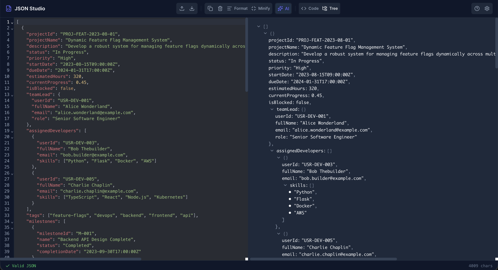

# JSON Studio ⚡️

**The Ultimate Client-Side JSON Editor.**

JSON Studio is a powerful, privacy-focused JSON editor built for developers. It combines a robust code editor with AI-powered features to help you fix, generate, and understand your data instantly.



## ✨ Features

### 🧠 AI Command Center
Use the power of LLMs (Gemini/OpenAI) directly in your editor:
-   **Auto-Fix**: Instantly repair invalid JSON with a single click.
-   **Generate Data**: Create realistic mock data from natural language descriptions.
-   **Natural Language Query**: Filter and interpret data using plain English.
-   **Smart Convert**: Transform JSON to CSV, YAML, or XML.
-   **Explain & Schema**: Generate TypeScript interfaces or get a summary of your data structure.

### 🛠 Powerful Editor
-   **Dual Views**: Switch between **Code** and **Tree** views.
-   **Search & Replace**: Full regex support (`Cmd+F`).
-   **Format & Minify**: Prettify or compact your JSON instantly.
-   **Error visualization**: See exactly where your JSON is broken.

### 🚀 Productivity Pro
-   **Global Shortcuts**:
    -   `Cmd+K`: Open AI Command Palette.
    -   `Cmd+Shift+F`: Quick Fix JSON.
    -   `Cmd+S`: Save file.
-   **Magic Paste**: Paste JSON anywhere on the empty screen to load it.
-   **Drag & Drop**: Open files instantly.
-   **Auto-Save**: You never lose your work.

### 🔒 100% Private
-   **Client-Side Only**: Your JSON data never leaves your browser.
-   **Bring Your Own Key**: Your API keys are stored in your browser's local storage and request directly to the AI providers. Zero middlemen.

## 🚀 Getting Started

### Prerequisites
-   Node.js (v18+)

### Installation

1.  Clone the repository:
    ```bash
    git clone https://github.com/tejus07/json-studio.git
    cd json-studio
    ```

2.  Install dependencies:
    ```bash
    npm install
    ```

3.  Start the development server:
    ```bash
    npm run dev
    ```

4.  Build for production:
    ```bash
    npm run build
    ```

## 💻 Tech Stack
-   **Framework**: React 19 + Vite
-   **Language**: TypeScript
-   **Editor**: CodeMirror 6
-   **Styling**: Vanilla CSS (Variables & Modules)
-   **State**: Zustand
-   **Icons**: Lucide React

## 📄 License
MIT
